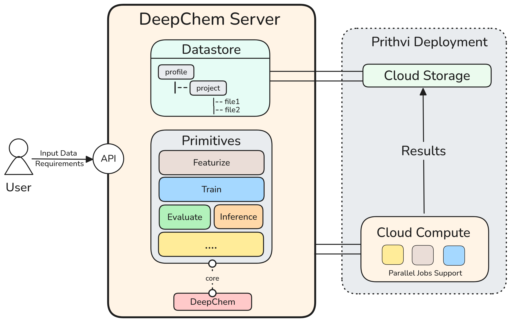

DeepChem Server Documentation
==============================

Welcome to DeepChem Server, a minimal cloud infrastructure for DeepChem that provides a FastAPI-based backend for managing datasets, running featurization tasks, and building machine learning models with DeepChem.

DeepChem Server offers a streamlined way to:

* Upload and manage datasets in various formats
* Perform molecular featurization using DeepChem's extensive featurizer library
* Store and retrieve models and data through a unified datastore API
* Access functionality through both REST API endpoints and a Python client library

.. toctree::
   :maxdepth: 2
   :caption: Contents:

   get_started/index
   api_reference/index
   py_ds_library/index

Quick Start
-----------

To get started with DeepChem Server:

1. **Installation**: Clone the repository and run the server using Docker
2. **Upload Data**: Use the API or Python client to upload your datasets
3. **Featurize**: Transform your molecular data using DeepChem featurizers
4. **Build Models**: Train and deploy machine learning models

Server Setup
~~~~~~~~~~~~

The fastest way to get started is using Docker:

.. code-block:: bash

   git clone <repository-url>
   cd deepchem-server
   bash docker.sh

This will start the server on ``http://localhost:8000``.

Key Features
------------

* **FastAPI Backend**: Modern, fast web framework with automatic API documentation
* **DeepChem Integration**: Built-in support for molecular featurization and modeling
* **Flexible Storage**: Disk-based datastore with support for various data formats
* **Python Client**: Easy-to-use Python library for programmatic access
* **Docker Support**: Containerized deployment for easy setup and scaling

Architecture Overview
---------------------

DeepChem Server consists of several key components:

* **API Layer**: FastAPI routers handling HTTP requests
* **Core Modules**: Business logic for data handling, featurization, and model management
* **Datastore**: Abstract storage layer with concrete disk implementation
* **Client Library**: Python SDK for easy integration

Indices and tables
==================

* :ref:`genindex`
* :ref:`modindex`
* :ref:`search` 